# PROJECT_OVERVIEW.md — Innovic ERP, end to end

Read-only documentation. Facts taken from the repo on branch `test`, commit `f760515f`
(worktree `C:\Innovic_projects\innovic-erp\wt-test`). Every path below is relative to that root.
Where something does not exist, it says **NOT PRESENT**.

Companion audits: `RM_AUDIT_REPORT.md` (repo root) and `docs/specs/BOM_STORE_AUDIT_REPORT.md`.

---

## 1. What the system is

A manufacturing ERP for a job-shop: the factory takes customer orders, plans them, makes parts on
machines, inspects them, and ships them. It replaces a 29,000-line single-page HTML app backed by
Firebase (`legacy/InnovicERP_v82_12_3_DataLossFix_29-04-2026.html`, kept as the specification of
record — `CLAUDE.md:37-48`).

- **Users:** ~15–20 at once today, designed to reach 100 (`CLAUDE.md:41-42`). Departments:
  Sales, Planning, Production, Store, Purchase, QC, Design, Finance, System
  (`packages/shared/src/enums/access-control.ts:17-39`).
- **Size:** 92 API modules (`apps/api/src/modules/`), 87 web modules (`apps/web/src/modules/`),
  138 screen files, 101 database tables (`apps/api/src/db/schema.ts`), 151 migration files.
- **Region / time:** Mumbai `ap-south-1`; everything stored UTC, shown IST
  (`CLAUDE.md:44-45`, `docs/ARCHITECTURE.md:63`).

**Deployment**

| Piece                        | TEST                                                                                           | PRODUCTION                                                                         |
| ---------------------------- | ---------------------------------------------------------------------------------------------- | ---------------------------------------------------------------------------------- |
| Web (Cloudflare Pages)       | `innovic-erp.pages.dev`, built from branch `test` (`.github/workflows/deploy-web-test.yml:20`) | `innovicerp.com`, built from branch `main` (`.github/workflows/deploy-web.yml:17`) |
| API (Railway, Docker)        | `api-test-production-19ca.up.railway.app` (`deploy-web-test.yml:54`)                           | `api-production-06c90.up.railway.app` (`deploy-web.yml:11`)                        |
| Database (Supabase Postgres) | its own project                                                                                | a **separate** project                                                             |
| File storage                 | Supabase Storage bucket `qc-docs`                                                              | same bucket name, own project                                                      |

The two databases are separate, so **every migration must be run twice, by hand**
(`apps/api/src/db/migrations/README.md:37-46`).

---

## 2. Tech stack and repo layout

**Stack** (locked by `CLAUDE.md:223-270`; versions from the manifests)

- API: TypeScript, Fastify 5, Drizzle ORM 0.36, `postgres` driver 3.4, Zod 3, Pino 9,
  `@supabase/supabase-js` 2 (`apps/api/package.json:29-40`).
- Web: React 18, Vite 5, TanStack Router + Query, Zustand, react-hook-form, Tailwind,
  Playwright (`apps/web/package.json:22-53`).
- Database: Supabase Postgres; the API connects as the `postgres` user over the pooled URL
  (`apps/api/src/db/client.ts:8`).
- Auth: Supabase Auth JWT, checked on the server (`apps/api/src/plugins/auth.ts:17-21`).

**Repo tree, two levels deep**

```
innovic-erp/
├── apps/
│   ├── api/          Fastify server (src/db, src/lib, src/modules, src/plugins, server.ts)
│   └── web/          React app (src/modules, src/components, src/lib, src/styles, e2e/)
├── packages/
│   └── shared/       Zod schemas + enums used by BOTH apps (the contract)
├── migration/        one-off Firestore -> Postgres scripts (not used day to day)
├── legacy/           the old single-file HTML ERP (specification of record)
├── docs/             ARCHITECTURE, SCHEMA, DECISIONS, TASKS, ISSUES, RUNBOOK, specs/, sql/, audits/
├── scripts/          check-agents.mjs
└── .claude/          agent definitions + skills (house rules for AI sessions)
```

Inside the API, every module is the same three files:
`apps/api/src/modules/<module>/routes.ts` (declare the URL), `service.ts` (all the logic),
and its Zod schema in `packages/shared/src/schemas/<module>.ts` (`CLAUDE.md:322-346`).

---

## 3. Architecture diagram

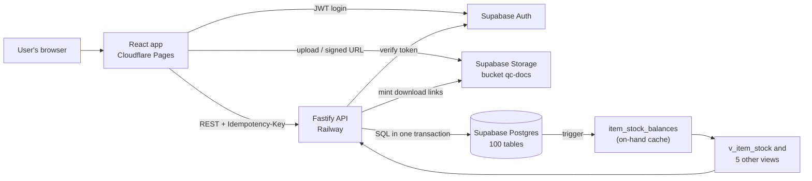

Notes on this picture:

- The browser never calculates stock. All the rules live in the service layer
  (`CLAUDE.md:274-276`).
- Files go **straight from the browser to Supabase Storage**, not through the API
  (`apps/web/src/lib/storage.ts:13-27`). The API only mints download links
  (`apps/api/src/modules/drawing-files/routes.ts:10`, `item-images/routes.ts:10`).
- There are **no Supabase RPC functions and no Realtime on stock screens** — NOT PRESENT.

---

## 4. Module map

The main modules. (92 exist; the rest are reports and dashboards that only read.)

| Module                                                    | What it does                                                          | Main tables                                                                      | Key service functions                                                                                           | Screens                                                        |
| --------------------------------------------------------- | --------------------------------------------------------------------- | -------------------------------------------------------------------------------- | --------------------------------------------------------------------------------------------------------------- | -------------------------------------------------------------- |
| `items`                                                   | Item master; code is the permanent key                                | `items`                                                                          | `createItem:147`, `updateItem:350`, `nextItemCode:124` (`ITM-####`)                                             | `items/routes/{list,detail,edit}.tsx`                          |
| `bom-master`                                              | Parent item and its child parts                                       | `bom_masters`, `bom_master_lines`, `bom_master_revisions`                        | `createBomMaster:640`, `updateBomMaster:726`, `cascadeBomToSoLine` (`cascade.ts:96`)                            | `bom-master/routes/{list,detail,new,edit}.tsx`                 |
| `route-cards`                                             | The standard list of operations for an item                           | `route_cards`, `route_card_ops`, `route_card_revisions`                          | `createRouteCard:603`, `updateRouteCard:708`, `saveRouteCardForItem:1254`                                       | `route-cards/routes/{list,detail,new,edit}.tsx`                |
| `sales-orders`                                            | Customer orders and their lines                                       | `sales_orders`, `sales_order_lines`, `so_milestones`                             | `createSalesOrder`, `updateSalesOrder`                                                                          | `sales-orders/routes/{list,detail,edit}.tsx`                   |
| `so-planning` / `plans`                                   | Turn an order line into a plan                                        | `plans`, `plan_ops`                                                              | `getPlanningBom:1131`, `raisePlanningPr:1351`, `createPlan:483`, `executePlan:1018`, `buildJobCardFromOps:1132` | `so-planning/routes/workflow.tsx`, `plans/routes/*`            |
| `production-orders`                                       | `IN-PRO-#####`: plan + route card -> job card; credits stock at close | `production_orders`, `production_order_closes`                                   | `createProductionOrder:616`, `closeProductionOrder:892`, `reverseProductionOrderClose:1055`                     | `production-orders/routes/{list,detail,new,close}.tsx`         |
| `job-cards`                                               | `IN-JC-YY-#####`: the batch on the floor                              | `job_cards`, `jc_ops`                                                            | `createJobCard:1768`, `updateJobCard:1928`, `nextJcCode:1291`                                                   | `job-cards/routes/{list,new,edit,status}.tsx`                  |
| `op-entry` / `jc-ops`                                     | Start, log and QC each operation                                      | `op_log`, `running_ops`                                                          | `startOp:2004`, `submitOpLog:1152`, `submitQcLog:1197`, `stopOp:2254`                                           | `op-entry/routes/{index,running}.tsx`                          |
| `purchase-requests` / `purchase-orders`                   | `IN-PR-` and `IN-MPO/JWPO/SPO/OPO-`                                   | `purchase_requests`, `purchase_orders`, `purchase_order_lines`, `jc_op_po_lines` | `createPurchaseRequest:880`, PO create/approve                                                                  | `purchase-*/routes/*`                                          |
| `goods-receipt-notes`                                     | `IN-GRN-#####`: material arrives                                      | `goods_receipt_notes`, `goods_receipt_note_lines`                                | `createGoodsReceiptNote:758`, `insertGrnForOspReceipt:887`, `creditGrnQcStock` (`cascades.ts:318`)              | `goods-receipt-notes/routes/{list,detail,edit}.tsx`            |
| `incoming-qc`                                             | Accept or reject what arrived                                         | writes GRN lines + `nc_register`                                                 | `submitIncomingQc:492`                                                                                          | `incoming-qc/routes/index.tsx`                                 |
| `delivery-challans`                                       | `IN-DC-#####`: send parts to an outside vendor and get them back      | `delivery_challans`, `_lines`, `_receipts`, `_receipt_lines`                     | `createDeliveryChallan:1021`, `receiveAgainstDeliveryChallan:1360`                                              | `delivery-challans/routes/{list,detail,receive}.tsx`           |
| `nc-register`                                             | Rejects, what to do with them, rework                                 | `nc_register`, `capa_records`                                                    | `disposeNcCascade` (`cascades.ts:196`), `createRecoveryJobCard` (`recovery.ts:161`)                             | `nc-register/routes/*`                                         |
| `store-inventory` / `store-transactions`                  | On-hand and the stock ledger                                          | `store_transactions`, `item_stock_balances`                                      | `listStoreInventory:41`, `adjustStock:205`, `getItemBalance:161`                                                | `store-inventory/routes/list.tsx`                              |
| `store-issues`                                            | `ISS-NNNNN`: issue material out                                       | `store_issues`                                                                   | `createStoreIssue:172`                                                                                          | `store-issues/routes/list.tsx`                                 |
| `tool-issues`                                             | `TIS-`: issue a tool and get it back                                  | `tool_issues`, `tool_issue_returns`                                              | `createToolIssue:219`, `recordToolReturn:307`                                                                   | inside `store-issues/routes/list.tsx`                          |
| `party-materials` / `party-grn` / `party-material-issues` | Customer-owned material (`PM-`, `PGRN-`, `IN-PMI-`)                   | `party_materials`, `party_grn(+lines)`, `party_material_issues`                  | `createPartyGrn:273`, `createPartyMaterialIssue:108`                                                            | `party-materials/routes/list.tsx`, `party-grn/routes/list.tsx` |
| `job-work-orders`                                         | `IN-JW-#####`: work done on the customer's material                   | `job_work_orders`, `job_work_order_lines`                                        | `createJobWorkOrder:720`                                                                                        | `job-work-orders/routes/{list,detail,edit}.tsx`                |
| `assembly`                                                | Build equipment from a BOM                                            | `assembly_units`, `assembly_tracking`                                            | `markUnitAssembled:533`, `startAssembly:675`, `stopAssembly:774`, `undoLastUnit:968`                            | `assembly/routes/{list,detail}.tsx`                            |
| `customer-dispatches`                                     | Ship to the customer                                                  | `customer_dispatches`, `customer_dispatch_lines`                                 | `createDispatch:815`, `cancelDispatch:948`                                                                      | `customer-dispatches/routes/{list,create}.tsx`                 |
| `access-control`                                          | Who may do what                                                       | `user_access`                                                                    | `getMyAccess:135`, `saveUserAccess:441`                                                                         | `access-control/routes/list.tsx`                               |
| `activity-log` / `trash`                                  | Audit trail and undelete                                              | `activity_log`                                                                   | `emitActivityLog:154`, `restoreFromTrash:184`                                                                   | `activity-log/routes/list.tsx`, `trash/routes/list.tsx`        |
| `qc-documents`                                            | QC papers per job card, with piece serial ranges                      | `qc_documents`, `file_registry`                                                  | serial ranges at `service.ts:711-729`                                                                           | `qc-documents/routes/list.tsx`                                 |

---

## 5. Master data

- **Items** (`schema.ts:201-268`) — `code` is unique per company and permanent; `uom` is one of
  NOS/KGS/SET/MTR; `item_type` is `component` or `assembly`; `procurement_type` is `make` or `buy`;
  `material` is free text. There is **no grade or size field on the item** and **no lot / heat /
  batch flag** — NOT PRESENT (`RM_AUDIT_REPORT.md §1c`).
- **BOM** (`schema.ts:2776-2940`) — one level only. A line holds the child item and `qty_per_set`.
  A multi-level BOM (1 / 1.1 / 1.1.1) is **NOT PRESENT**.
- **Route cards** (`schema.ts:789-921`) — one active card per item; its operations are copied onto
  every job card.
- **Material grades / sizes** (`schema.ts:537-630`) — simple lists (`GRD-###`, `SZ-####`). They are
  linked to route cards, plans, job cards and BOM lines, but **not to items**.
- **Clients** (`schema.ts:269-317`) and **vendors** (`:318-376`) — code, name, contact, GST, address.
- **Users** (`schema.ts:156-200`) — email, full name, role, approval limit; access tiers live in a
  separate `user_access` row (section 8).

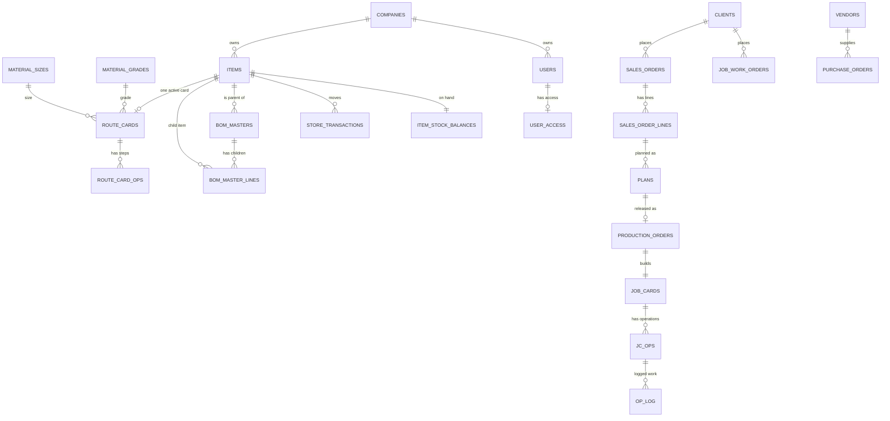

---

## 6. Business flows

Document codes used below: `IN-SO-#####` sales order, `IN-JW-#####` job work order,
`PLN-NNNN` plan, `IN-PRO-#####` production order, `IN-JC-YY-#####` job card,
`IN-PR-#####` purchase request, `IN-MPO/JWPO/SPO/OPO-#####` purchase order,
`IN-GRN-#####` goods receipt, `IN-DC-#####` delivery challan, `ISS-NNNNN` store issue,
`TIS-` tool issue, `PM-` party material, `PGRN-` party GRN, `IN-PMI-` party material issue.
(All from `packages/shared/src/schemas/doc-number.ts:34-53` and the module services.)

### 6a. Order to dispatch

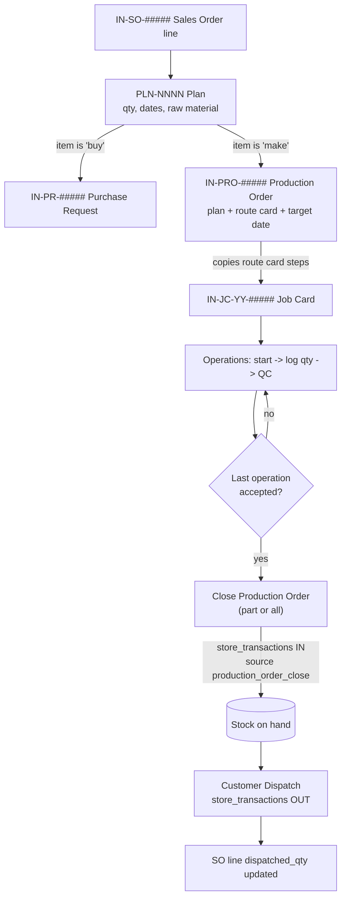

The key rule (ADR-170, `docs/DECISIONS.md:9124`): a job card that belongs to a Production Order
credits stock **only once, at close**. Its normal QC credit is switched off.
Since ADR-179 the close can be done **in parts** as pieces finish, and can be reversed
(`production-orders/service.ts:892,1055`).

### 6b. Purchase

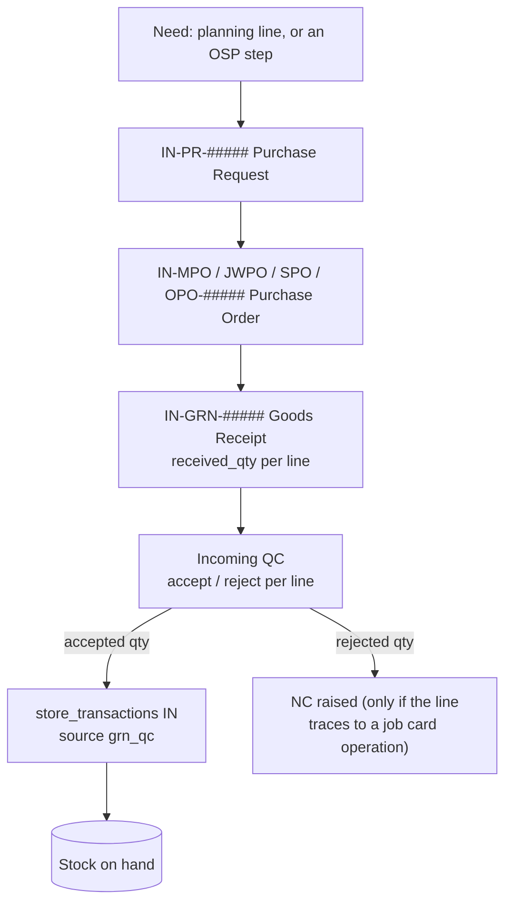

Stock is credited **at QC accept, never at GRN save** (`goods-receipt-notes/cascades.ts:318-375`).
Rejected quantity is simply not credited; there is no quarantine location — NOT PRESENT.

### 6c. Outside processing (OSP)

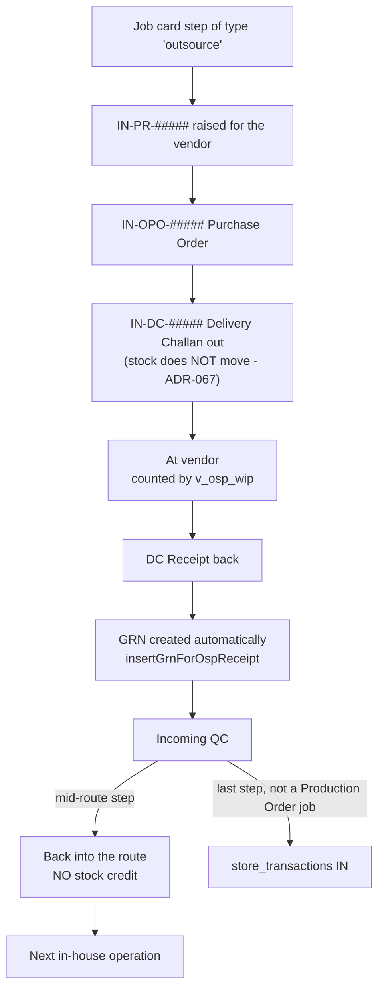

Sending parts out is deliberately **stock-neutral** (`delivery-challans/service.ts:1154-1160`).
A mid-route return is work in progress, not finished goods (ADR-092).

### 6d. Job work on the customer's material

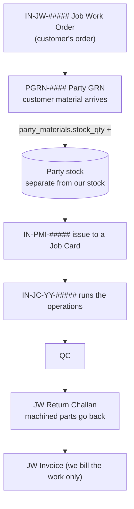

Party stock is **never** part of the main stock ledger
(`party-material-issues/service.ts:5`). A job card can only start when enough customer
material has been issued (`op-entry/service.ts:2019-2033`).

### 6e. Assembly

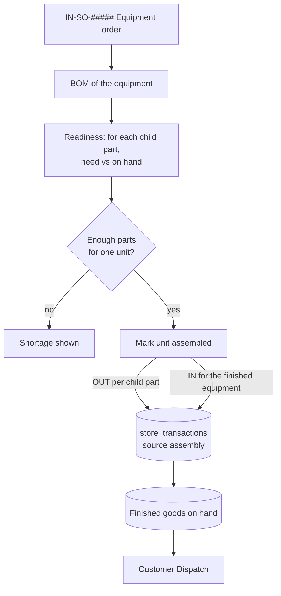

Components are consumed **in one step, when the unit is marked assembled**
(`assembly/stock-cascade.ts:104-170`). Staging, pick lists and kit checks are **NOT PRESENT**.

### 6f. Non-conformance and rework

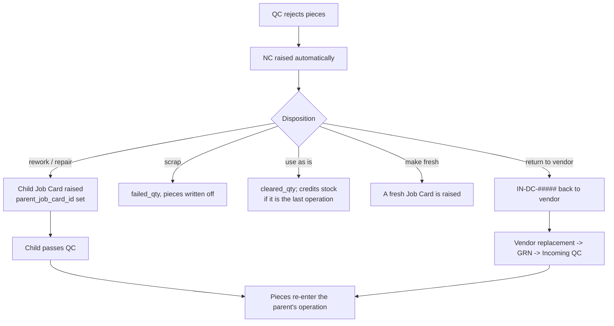

ADR-175 (`docs/DECISIONS.md:9361`): whatever the disposition, the whole chain is settled —
the NC ledger balances, stock is credited once, and the job card closes all the way up.

### 6g. Store

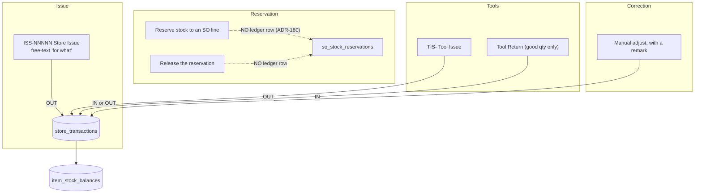

Two things worth knowing: a store issue links to a job card only as **free text**
(`ref_type` / `ref_no`), and there is no store-issue return — NOT PRESENT.

Reserving stock does **not** move it (ADR-180, migration 0141). A booking marks pieces as
promised and leaves them on the shelf; only a real stock-out reduces Physical. See §6i.

### 6h. Stock ledger — every writer

Every write follows the same three steps: lock the item row, read on-hand, insert one ledger row.

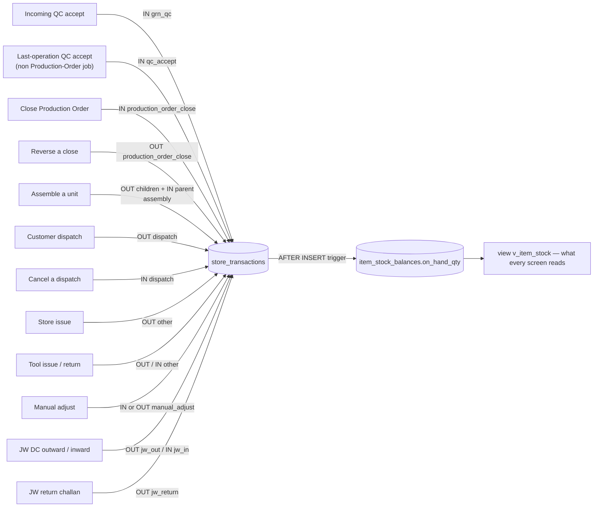

The 19 places in the code that write the ledger are listed in
`docs/specs/BOM_STORE_AUDIT_REPORT.md` §8. Quantities are **whole numbers only**, tracked per
item — with no lot, heat number, location or quality status (NOT PRESENT).

---

### 6i. Stock reservation — booking, not moving (ADR-180)

Three figures, one definition, used on every stock screen:

| Figure        | Meaning                                    | Where it comes from                                           |
| ------------- | ------------------------------------------ | ------------------------------------------------------------- |
| **Physical**  | what is on the shelf, promised or not      | `item_stock_balances.on_hand_qty`                             |
| **Reserved**  | promised to an SO line, still on the shelf | Σ (`qty − consumed_qty − released_qty`) of rows still holding |
| **Available** | what may still be promised                 | Physical − Reserved                                           |

Published together by the view `v_item_stock_availability` (migration 0141). All the
arithmetic, the row lock and the audit trail live in `apps/api/src/lib/stock-reservation.ts`
— no other service may work them out for itself.

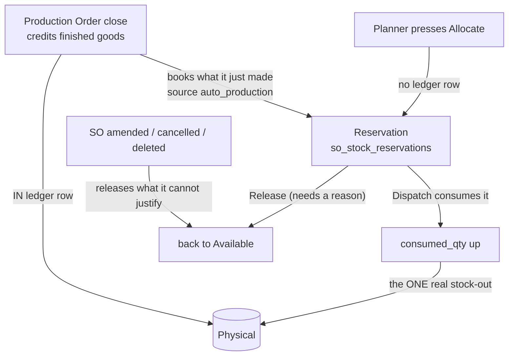

Rules that hold at all times, checked by `docs/sql/check-stock-reservation.sql`:

- A reservation **never** writes to `store_transactions`. Physical moves only on a real
  stock-out.
- A booking must be for the item the order line actually ordered — so a BOM-child plan
  (parent SO line, child item) can never park child stock on the parent.
- A booking cannot exceed Available, nor what the line still needs
  (`orderQty − dispatchedQty − already held`).
- Two people cannot book the same free stock: every write path takes
  `SELECT … FROM items … FOR UPDATE` and re-reads Available inside that lock.
- A replayed Production Order close cannot book twice — the automatic booking carries
  `production_order_close_id`, unique while live.
- Already-dispatched pieces are never un-booked or reversed automatically.

## 7. Status lifecycles

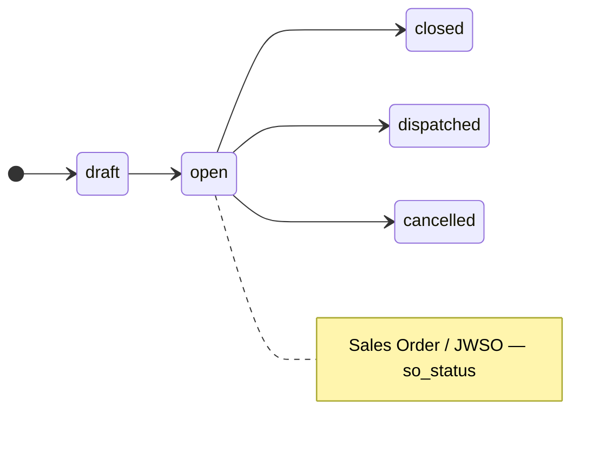

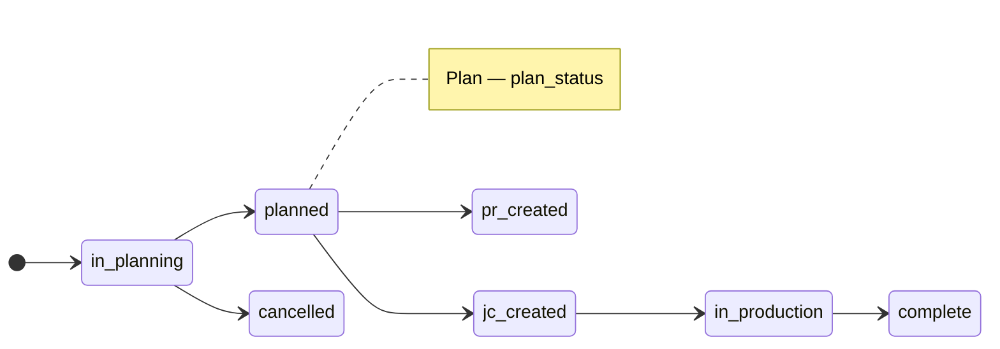

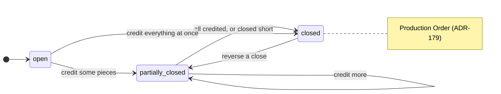

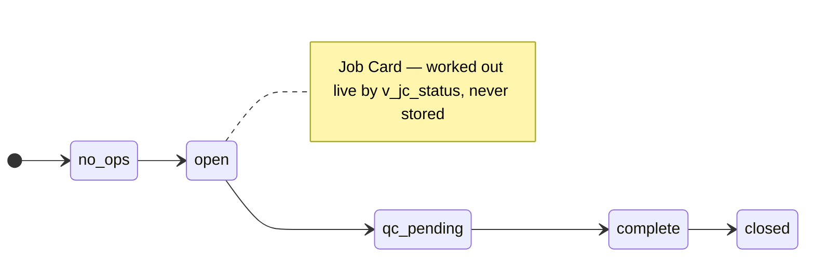

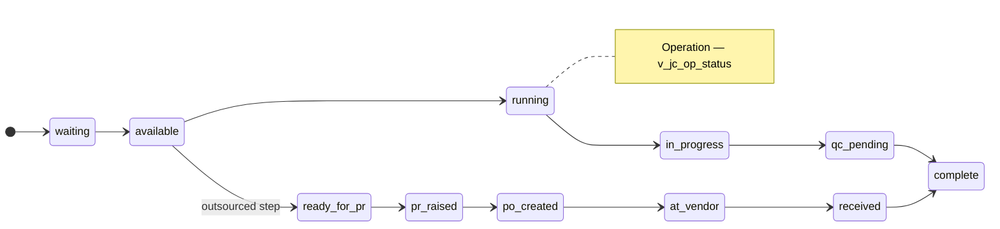

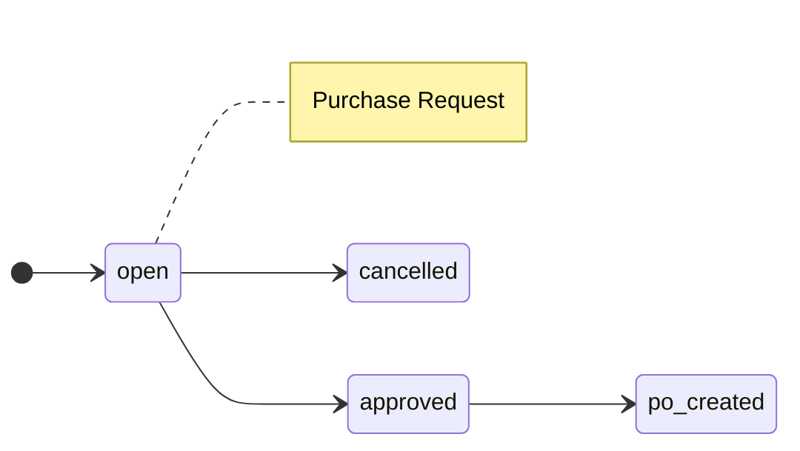

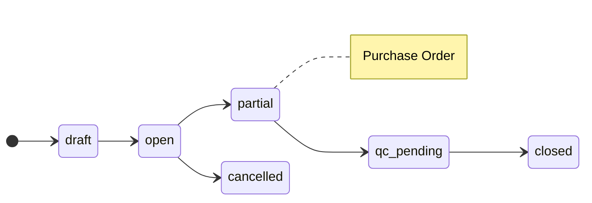

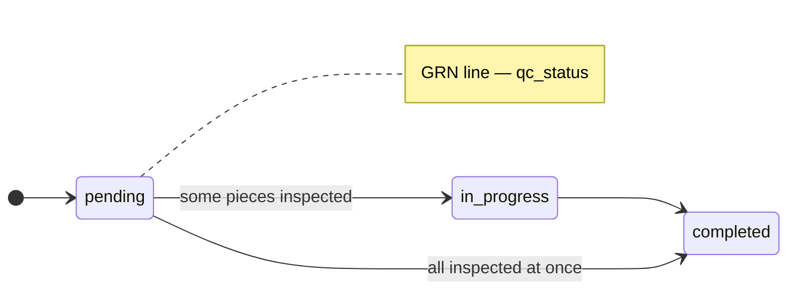

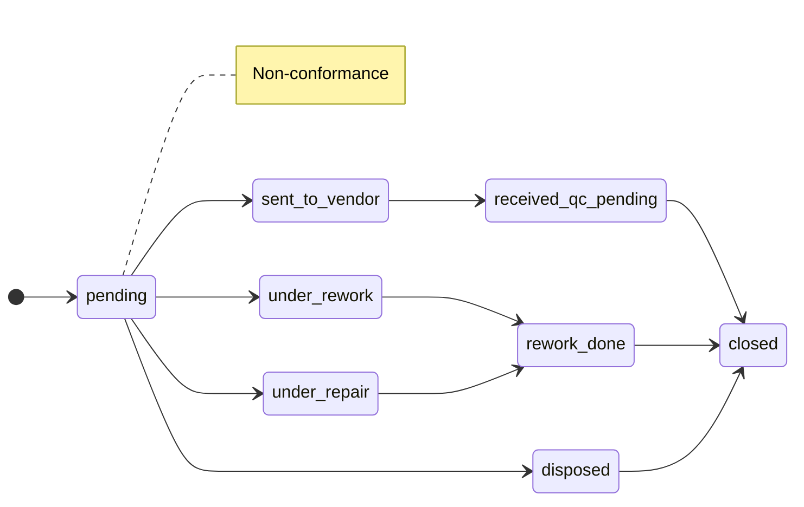

```mermaid
stateDiagram-v2
  direction LR
  [*] --> dispatched
  dispatched --> cancelled
  note right of dispatched : Customer Dispatch — only two states
```

Delivery challans are `issued -> received -> cancelled` (`packages/shared/src/enums/dc-status.ts:1`).

---

## 8. Permissions

Three ideas stacked on top of each other.

1. **Role** on the user row: `admin, manager, operator, qc, procurement, dispatch, design, viewer`
   (`packages/shared/src/enums/user-role.ts:1-10`). The role is _worked out from_ the tiers below,
   not chosen separately.
2. **Tier per department** in `user_access.departments`
   (`packages/shared/src/enums/access-control.ts:168-208`):

   | Tier | Name       | May                                       |
   | ---- | ---------- | ----------------------------------------- |
   | L1   | Viewer     | look only, never sees prices              |
   | L2   | Data Entry | create new records, not change saved ones |
   | L3   | Editor     | create and change, not approve            |
   | L4   | Approver   | approve only — never their own record     |
   | L5   | Dept Admin | everything inside that department         |

3. **Page keys** (`ACCESS_FORMS`, `access-control.ts:57-112`) — 39 keys such as `so_create`,
   `plan_create`, `prodorder_create`, `jc_create`, `op_entry`, `grn_create`, `qc_incoming`,
   `issue_create`, `toolissue_create`, `party_create`, `dispatch_create`, `po_create`,
   `ospdc_create`, `item_create`, `rawmat_create`, `accesscontrol_manage`. Each can be switched
   **off** for one page below the department tier (`viewOff / entryOff / editOff / approveOff`,
   `packages/shared/src/schemas/access-control.ts:77-85`).

**How a request is checked** — `requireFormAccess(user, formKey, action)`
(`apps/api/src/lib/access.ts:58-81`): admins pass straight through; otherwise the user's effective
rights for that page are loaded and the action (`view`/`entry`/`edit`/`approve`) must be allowed,
or the call is refused with a plain-English message naming the page. The browser hides buttons
with the same helpers (`apps/web/src/lib/access-control.ts:21-45`), but hiding is never the
enforcement.

**Important:** the database's own row-level security rules exist but **do not run**, because the
API connects as the `postgres` superuser. The service checks are the real wall — the code says so
itself at `packages/shared/src/enums/access-control.ts:139-142`.

---

## 9. Data integrity rules

- **One transaction per write.** Every service call runs inside `withUserContext`, which opens a
  transaction and stamps the user's identity onto the session
  (`apps/api/src/db/with-user-context.ts:26-40`). Any error rolls the whole thing back.
- **Row locks before touching stock.** Every stock writer does
  `SELECT 1 FROM items WHERE id = ... FOR UPDATE` first, then reads on-hand, then writes
  (36 lock sites). The Production Order row is locked the same way before a close.
- **Idempotency.** The browser sends a random `Idempotency-Key` on every non-GET request
  (`apps/web/src/lib/api.ts:72-73`); the server stores the first answer and replays it if the same
  key comes back (`apps/api/src/plugins/idempotency.ts`, ADR-172). A double-click cannot post twice.
- **Append-only tables.** `store_transactions`, `op_log`, `production_order_closes` and
  `task_history` are only ever inserted into. Corrections are written as opposite entries, never
  as edits or deletes.
- **Soft delete.** 84 tables carry `deleted_at`; nothing is really removed
  (`CLAUDE.md:281`). The Trash screen restores them.
- **Triggers.** One stock trigger (`apply_store_txn_to_balance`, migration `0020:77-113`) keeps
  the on-hand cache correct, plus `set_updated_at` on 26 tables and two Supabase auth-sync
  triggers.
- **Views** do the hard sums so no screen has to: `v_item_stock` (on hand),
  `v_jc_op_status` (per operation: available, pending, at vendor, status),
  `v_jc_status` (whole job card), `v_osp_wip` (out at vendors),
  `v_nc_op_breakup` (rejects per operation), `v_op_machine_output` (output per machine).
- **Audit trail.** `emitActivityLog` (`activity-log/service.ts:154`) writes one line per action
  inside the same transaction; 37 modules call it. It stores who, when, what and a sentence —
  **not** before/after values (NOT PRESENT).

---

## 10. Environments and deploy

```mermaid
flowchart LR
  DEV["Edit in wt-test<br/>branch test"] --> REV["/code-review, then typecheck + lint + build"]
  REV --> PUSH["Push branch test"]
  PUSH --> TESTSITE["TEST site + TEST API<br/>rebuild automatically"]
  TESTSITE --> EYE["User checks it on TEST"]
  EYE -->|"user says 'push to main'"| MERGE["Merge test into main"]
  MERGE --> PRODSITE["innovicerp.com + PROD API"]
  MIG["Migration file NNNN_*.sql"] -.->|"run by hand"| TDB[("TEST database")]
  MIG -.->|"run by hand, user's call"| PDB[("PROD database")]
```

- **Worktrees:** `innovicerp/` is `main` (used by another terminal); `wt-test/` is `test` and is
  where work is done. Others exist for side branches.
- **TEST first, always.** Production is touched only when the user says so explicitly; production
  migrations are run by the user.
- **Migrations are hand-written SQL**, numbered, forward-only, and idempotent. They are applied
  with `apps/api/src/db/apply-sql.ts` — **nothing applies them automatically**, not the CI and not
  the Railway deploy (`docs/RUNBOOK.md:257`). `drizzle-kit generate/migrate` must not be used
  (`migrations/README.md:3`).
- **House rules for AI sessions** (`.claude/agents/_house-rules.md`): never run the API test suite
  (its setup deletes rows from the **production** database), never `db:push` or `seed`, never
  commit with a bare `git commit` (the git index is shared with another terminal — commit named
  paths instead).
- **CI** runs lint, typecheck, format check and tests on `main`. The repo-wide format check is red
  for historical reasons; deploys still ship.

---

## 11. Docs index

| File                                                                                                             | What is in it                                                                 |
| ---------------------------------------------------------------------------------------------------------------- | ----------------------------------------------------------------------------- |
| `docs/ARCHITECTURE.md`                                                                                           | System picture, authorization layers, performance and backup targets          |
| `docs/SCHEMA.md`                                                                                                 | The living schema — must match `apps/api/src/db/schema.ts`                    |
| `docs/DECISIONS.md`                                                                                              | **180 ADRs**, newest `ADR-180` (reservation books stock instead of moving it) |
| `docs/CONVENTIONS.md`                                                                                            | Naming, module shape, error handling, the item-picker rule, commit format     |
| `docs/TASKS.md`                                                                                                  | Task tracker — last real update July 2026                                     |
| `docs/PENDING-TASKS.md`                                                                                          | 19 user change requests, all addressed, verified 2026-07-28                   |
| `docs/ISSUES.md`                                                                                                 | **273 numbered issues** found during the parity work                          |
| `docs/RUNBOOK.md`                                                                                                | Deploy, restore, rotate secrets, common failures                              |
| `docs/MIGRATION-LOG.md`                                                                                          | Firestore -> Postgres record per collection                                   |
| `docs/QC-NC-HANDLING-DESIGN.md`                                                                                  | The QC/NC design the 0122 migration implements                                |
| `docs/TRACEABILITY-REPORT.md`                                                                                    | How the "Related Documents" panel is built from real foreign keys             |
| `docs/GO_LIVE.md`, `DOMAIN-CUTOVER.md`, `LEGACY_AUDIT.md`, `STYLE_GUIDE.md`, `PARITY/`, `erp-map/`, `reference/` | Cutover, legacy audit, styling and mapping material                           |
| `docs/specs/BOM_STORE_AUDIT_REPORT.md`                                                                           | The BOM / store / returnables audit and minimal-change design                 |
| `docs/sql/`                                                                                                      | Hand-run helper SQL (e.g. `check-migrations.sql`)                             |
| `docs/page-registry.yaml`                                                                                        | Every screen mapped to its legacy counterpart                                 |
| `RM_AUDIT_REPORT.md` (repo root)                                                                                 | The raw-material readiness audit                                              |

**Latest migration:** `0142_backfill_production_order_closes.sql` (151 files in total).
Migrations `0141` and `0142` are applied to TEST only — both are pending on PROD.

---

## 12. Known gaps and work in progress

**From the two audit reports**

- No lot, heat number, mill certificate or serial tracking on stock — NOT PRESENT.
- No warehouse, location, rack or bin — NOT PRESENT.
- Stock has no quality status: a rejected piece is simply never credited; there is no quarantine.
- ~~Reserving stock **removes** it from on-hand~~ — **fixed** by ADR-180 (migration 0141):
  a booking now leaves Physical alone and only lowers Available.
- Stock quantities are whole numbers, which does not suit material bought by weight or length.
- A store issue points at a job card only by free text, and there is no way to return material,
  record an off-cut, or reconcile what was issued against what was used.
- BOMs are one level deep; sub-assemblies inside sub-assemblies are not modelled.
- BOM explosion counts on-hand only — it ignores what is already reserved, on order, or at a vendor.
- Saving a sales order with a BOM **automatically creates** child job cards and purchase requests;
  planning cannot choose what to release.
- Assembly has no staging, pick list or kit check; components are consumed in one step.
- Tools are tracked, but there is no instrument register and no calibration check — NOT PRESENT.
- The audit's suggestion is a single shared stock-lot layer rather than one solution per feature.
  Seven conflicts are listed there that need a decision before anything is built.

**From `docs/TASKS.md`**

- The file has not tracked work since July 2026; its "Current Phase" heading is out of date.
- Open: the sales-team cutover (`T-034`), and a set of decisions waiting on the user —
  hours vs minutes for cycle time, a GST percentage conflict, some styling questions.
- `docs/PENDING-TASKS.md` lists four small follow-ups (SO column on purchase screens, a central
  check in the operation-entry form, server-side search across all plans, one route-card data task).

**Currently in flight**

- Another terminal is editing the rule files (`CLAUDE.md`, `.claude/skills/styling/SKILL.md`).
- Branch `wip/main-checkpoint` holds ~3-week-old unfinished edits from the `innovicerp/` folder,
  parked safely; they are older than what is already on `main`.
- Tags `pre-rm-phase1` and `main-pre-rm-phase1` mark the backup taken before this work starts.
